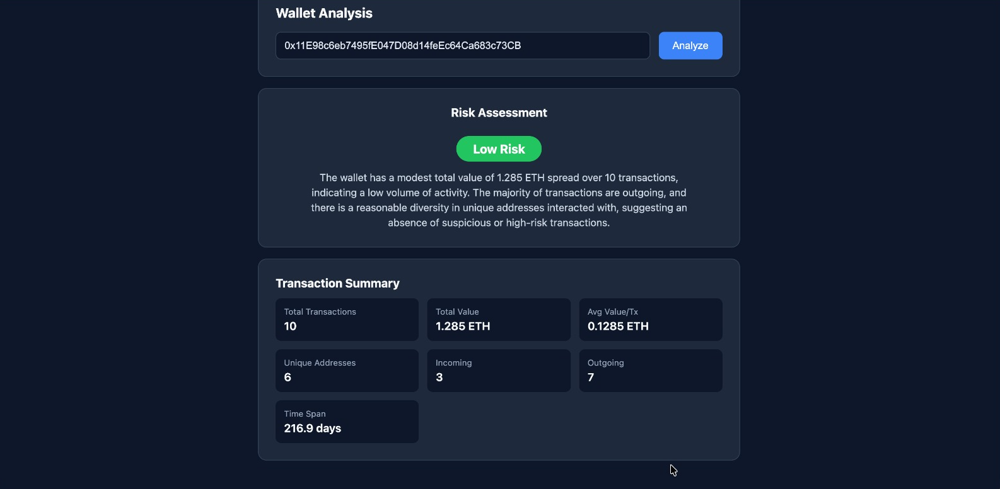
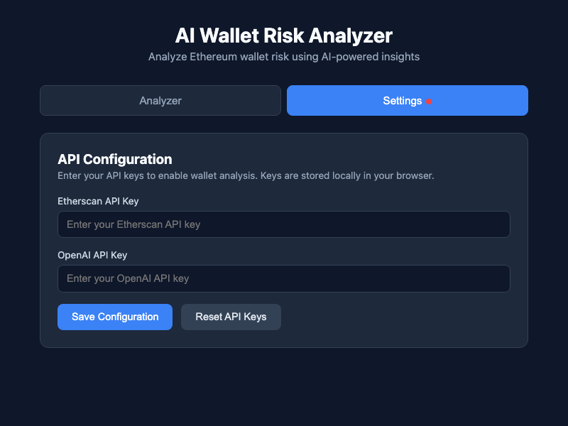

# AI Wallet Risk Analyzer

A full-stack Web3 + AI application that analyzes Ethereum wallet risk. Enter a wallet address, and the system fetches on-chain transactions via Etherscan, computes behavioral analytics, and generates an AI-powered risk score with a natural-language explanation.

## Screenshots

### Analyzer Page


### Settings Page


## Tech Stack

| Layer    | Technology              |
| -------- | ----------------------- |
| Frontend | React + Vite            |
| Backend  | Node.js + Express       |
| Web3 API | Etherscan V2            |
| AI       | OpenAI GPT (gpt-4o-mini)|

## Features

- **Wallet Analysis** — Enter any Ethereum address to get a risk assessment
- **AI Risk Scoring** — Returns Low / Medium / High risk with a detailed explanation
- **Transaction Summary** — Displays total value, frequency, unique counterparties, and in/out flow
- **API Key Management** — Configure and persist API keys via browser localStorage
- **Validation** — Address format checks, missing key warnings, and error handling
- **Loading States** — Spinner and status messages during analysis
- **Reset API Keys** — One-click button to clear stored credentials

## Project Structure

```
ai-wallet-risk-analyzer/
├── backend/
│   ├── package.json
│   ├── server.js            # Express server, /analyze-wallet endpoint
│   └── services.js          # Etherscan fetch + OpenAI risk analysis
├── frontend/
│   ├── index.html
│   ├── package.json
│   └── src/
│       ├── main.jsx
│       ├── App.jsx           # Tab navigation (Analyzer / Settings)
│       ├── App.css            # Dark theme UI styles
│       ├── components/
│       │   ├── Analyzer.jsx   # Wallet input + results display
│       │   └── Settings.jsx   # API key configuration form
│       └── utils/
│           └── config.js      # localStorage read / write / clear
├── screenshots/
│   ├── analyzer.png
│   └── settings.png
└── README.md
```

## Getting Started

### Prerequisites

- **Node.js** v18+
- **Etherscan API Key** — [Get one free](https://etherscan.io/apis)
- **OpenAI API Key** — [Get one here](https://platform.openai.com/api-keys)

### Installation

```bash
# Clone the repository
git clone <your-repo-url>
cd ai-wallet-risk-analyzer

# Install backend dependencies
cd backend
npm install

# Install frontend dependencies
cd ../frontend
npm install
```

### Running the App

**Terminal 1 — Start the backend:**

```bash
cd backend
npm start
```

Server runs on `http://localhost:3001`

**Terminal 2 — Start the frontend:**

```bash
cd frontend
npm run dev
```

App runs on `http://localhost:5173`

### Usage

1. Open `http://localhost:5173` in your browser
2. Go to **Settings** tab and enter your Etherscan + OpenAI API keys
3. Click **Save Configuration**
4. Switch to **Analyzer** tab
5. Paste an Ethereum wallet address (e.g. `0xde0B295669a9FD93d5F28D9Ec85E40f4cb697BAe`)
6. Click **Analyze** and view the risk assessment

## API Endpoint

### `POST /analyze-wallet`

**Request Body:**

```json
{
  "walletAddress": "0x...",
  "etherscanApiKey": "YOUR_ETHERSCAN_KEY",
  "aiApiKey": "YOUR_OPENAI_KEY"
}
```

**Response:**

```json
{
  "walletAddress": "0x...",
  "transactionCount": 10,
  "summary": {
    "totalTransactions": 10,
    "totalValueETH": 15.234,
    "avgValueETH": 1.5234,
    "uniqueAddresses": 8,
    "incomingCount": 4,
    "outgoingCount": 6,
    "timeSpanDays": 45.2
  },
  "riskScore": "Low",
  "explanation": "AI-generated risk explanation..."
}
```

## Design Decisions

- **Zero external HTTP libraries** — Backend uses Node.js built-in `https` module (no axios/node-fetch)
- **API keys sent per-request** — No `.env` files needed, no secrets stored on the server
- **localStorage persistence** — Keys survive page refreshes without any backend storage
- **Etherscan V2 API** — Uses the latest `chainid`-based endpoint format
- **Minimal dependencies** — Only `express` and `cors` on the backend; standard Vite + React on the frontend

## License

MIT
